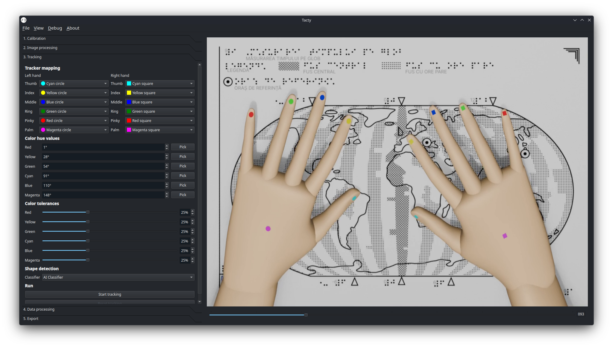

# Tacty

[Tacty](https://tacty.tactilelibrary.net) is an open source integrated tactile interaction analysis toolkit built using the [Qt Framework](https://www.qt.io/).



## Features

- Extract map area from the input video.
- Calibrate color tracking hues and tolerances.
- Multiple shape classifiers (Hu Moments, AI Classifier).
- Data cleanup (outlier detection, interpolation).
- `.csv` and `.xslx` export for the movement data, as well as a dedicated [GazePlotter](https://gazeplotter.com) exporter.
- Heatmap export.
- Background removal.
- Areas of interest.

## Install

### Windows

1. Download the latest `.exe` file from the [release page](https://github.com/TactileLibrary/tacty/releases).
2. Follow the steps in the installer.
3. Run the application from your Desktop or Start Menu.

### Linux

1. Ensure your distribution supports [AppImages](https://appimage.org/).
2. Download the latest `.AppImage` file from the [releage page](https://github.com/TactileLibrary/tacty/releases).
3. Double click the file to run the application.

### MacOS

1. Download the latest `.dmg` file from the [release page](https://github.com/TactileLibrary/tacty/releases).
2. Double click the file and drag it into your Applications folder.
3. Run it from your Applications folder or Launchpad.

> [!WARNING] 
> Since the app is unsigned you must authorize it to run by going into `System Settings > Privacy & Security`.

> [!WARNING] 
> While I try my best to support MacOS, I don't personally own any Apple devices. I test it occasionally on borrowed hardware, but please be patient if you encounter any issues.

## Build and contribute

### Running the app

This repository uses [uv](https://github.com/astral-sh/uv) to manage Python dependencies. Once installed, you can use:

```sh
uv sync # installs Python and dependencies
uv run tacty # run the app
```

If you don't wish to install uv on your system, you can also use the provided `devcontainer`.

### Production builds

For the production build we use [pyside6-deploy](https://doc.qt.io/qtforpython-6/deployment/deployment-pyside6-deploy.html) which makes use of [Nuitka](https://nuitka.net/) to compile Python code to C for better efficiency.

```sh
uv run pyside6-deploy -c ./pysidedeploy-windows.spec # windows build
uv run pyside6-deploy -c ./pysidedeploy-linux.spec # linux build
uv run pyside6-deploy -c ./pysidedeploy-macos.spec # macos build
```

This produces the directory `dist/tacty.dist`, which includes all required files for the current platform. To bunde these we use the [Inno Setup Installer](https://jrsoftware.org/isinfo.php) for Windows, [appimagetool](https://github.com/AppImage/appimagetool) for Linux, and the built-in `hdiutil` command on MacOS. More information can be found by looking at `.github/workflows/release.yml`.